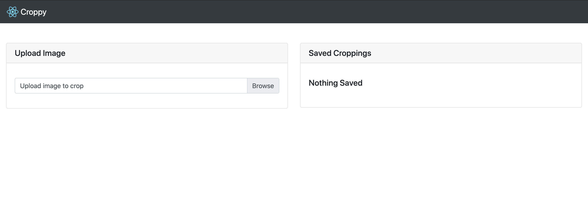

# Croppy



This web application allows the user to upload a file and segment it with a cropping tool. All cropped versions of the main image display on the right with their meta data.

This application is not fit for a production environment

## DEPENDENCIES

You only need Docker installed on your machine to run this application.

## HOW TO START

1. Clone the repo
2. Run the following command in the same folder as the docker-compose.yml file

```
docker-compose up -d
```
